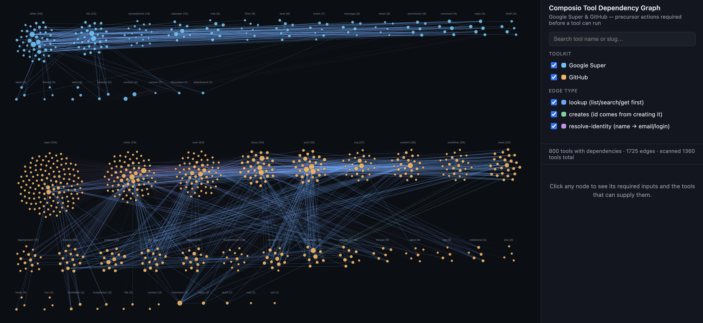

# Composio Tool Dependency Graph

An interactive map of possible dependencies between Composio's Google Super and GitHub tools. It explores a practical agent-planning question: which tool could supply an input that another tool needs?

**Stack:** TypeScript · JavaScript · Composio SDK · JSON Schema

## Preview



## Why it matters

A reply tool may need a thread ID from a search tool. An action addressed to a person may first require resolving their name to an email address. This project inspects tool schemas and visualizes candidate connections to make these relationships easier to explore.

## View the included graph

Clone the repository, then open `graph.html` in your browser:

```bash
git clone https://github.com/monisha-krishnamurthy/composio-tool-dependency-graph.git
cd composio-tool-dependency-graph
open graph.html
```

`open` is the macOS command; on other systems, open the file through your file manager. The included graph requires no API key to inspect.

## How it works

1. **Fetch:** `src/fetch-tools.ts` saves toolkit schemas under `data/`.
2. **Analyze:** `src/build-graph.js` matches required inputs to candidate output fields, including nested schema references.
3. **Visualize:** `src/build-viz.js` creates `graph.html` with search, filtering, pan/zoom, and tool details.

Edges distinguish lookup, creation, and identity-resolution relationships. Candidate matches are inferred from schema names and descriptions; they are not verified executable workflows.

## Rebuild from the included data

With Node.js and npm installed:

```bash
npm ci
node src/build-graph.js
node src/build-viz.js
```

To refresh tool schemas, set `COMPOSIO_API_KEY` in a local, ignored `.env` file, then run:

```bash
npx tsx src/fetch-tools.ts
node src/build-graph.js
node src/build-viz.js
```

The included `scaffold.sh` calls a hiring-specific external service and is not required for this workflow. `upload.sh` is also separate from local graph generation.

## Scope

The graph is a snapshot of tool metadata, not live account activity. Schema changes and heuristic matches can produce missing or incorrect edges. Validate dependencies before using them to execute actions.
